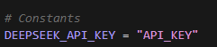

# 网页收藏夹整理大师

一个基于浏览器插件和Python后端的收藏夹标签整理工具

## 功能特点

- 支持网页内容快速提取
- 浏览器插件支持一键操作
- 自动化内容处理和保存

## 环境要求

- Python 3.10+
- Edge 浏览器 (版本 90+)
- 支持的操作系统: Windows/MacOS/Linux

## 安装步骤

### 1. 安装Python依赖

bash
pip install -r requirements.txt

### 2. 安装浏览器插件
1. 打开Edge浏览器
2. 进入扩展程序页面 (edge://extensions/)
3. 开启"开发者模式"
4. 点击"加载已解压的扩展程序"
5. 选择项目中的 `extension` 文件夹

## 启动服务
1. 在app.py中配置Deepseek的api_key


2. 启动后端服务:
```bash
python app.py
```

2. 服务默认运行在 `http://localhost:5000`

## 使用方法

1. 在浏览器中打开任意网页
2. 点击插件图标

4. 点击"提取"按钮

## 待办事项

- [ ] 修复知乎页面访问问题
  - [ ] 处理知乎反爬虫机制
  - [ ] 优化知乎页面内容提取
  - [ ] 添加用户代理模拟
- [ ] 优化错误处理机制
- [ ] 添加更多网站支持

## 常见问题

1. 如果遇到插件无法连接后端，请检查:
   - 后端服务是否正常运行
   - 端口是否被占用
   - 防火墙设置

2. 如果内容提取失败:
   - 确认网页是否可以正常访问
   - 对于知乎页面，目前正在修复中

3. 如果无法删除已有的标签:
   - 确认检查浏览器同步是否关闭

## 许可证

MIT License

## 联系方式

如有问题，请提交 Issue 或 Pull Request。